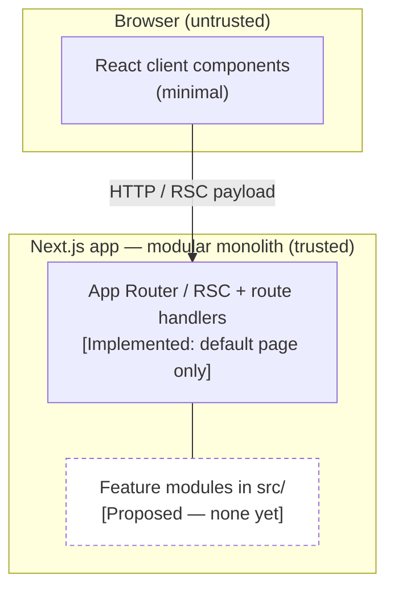
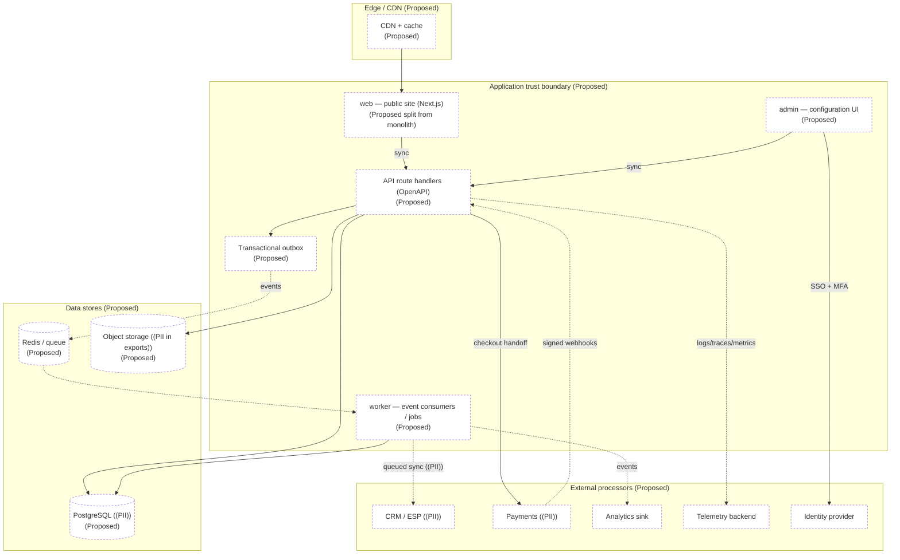

# Architecture map

System / container / component boundaries, data stores, external systems and trust
boundaries. Pairs with `SYSTEM_CONTEXT.md` (external view) and
`MODULE_DEPENDENCY_MAP.md` (module edges).

**Legend:** `[Implemented]` / `[Proposed]`. Solid = sync call · dashed = async
event. Subgraphs are trust boundaries. `((PII))` marks where personal data would
enter/rest/transform.

Last verified against commit: _pending first commit_

## Current (Implemented)

Today the repository contains a single Next.js application: App Router, RSC by
default, one static route (`/`), Tailwind v4, strict TypeScript. No database, no
API routes, no auth, no workers.

## Target (Proposed)

## Trust boundaries

| Boundary                     | Notes                                                                            | Status      |
| ---------------------------- | -------------------------------------------------------------------------------- | ----------- |
| Browser → server             | All input untrusted; validate + encode at the boundary.                          | Implemented |
| Server → PostgreSQL          | Parameterized queries only; PII at rest here.                                    | Proposed    |
| Server ↔ external processors | Adapters + allowlists + signature verification; PII leaves here (CRM, payments). | Proposed    |
| Admin → identity provider    | MFA required for privileged roles.                                               | Proposed    |
| Outbox → queue → worker      | Async; at-least-once; idempotent consumers; DLQ.                                 | Proposed    |

## Change process

Before a block: add the change here as a `Proposed` node/edge. After: promote to
implemented, remove stale proposed elements, update
`Last verified against commit:`. See
`.claude/skills/documentation-maps-and-diagrams/SKILL.md`.
