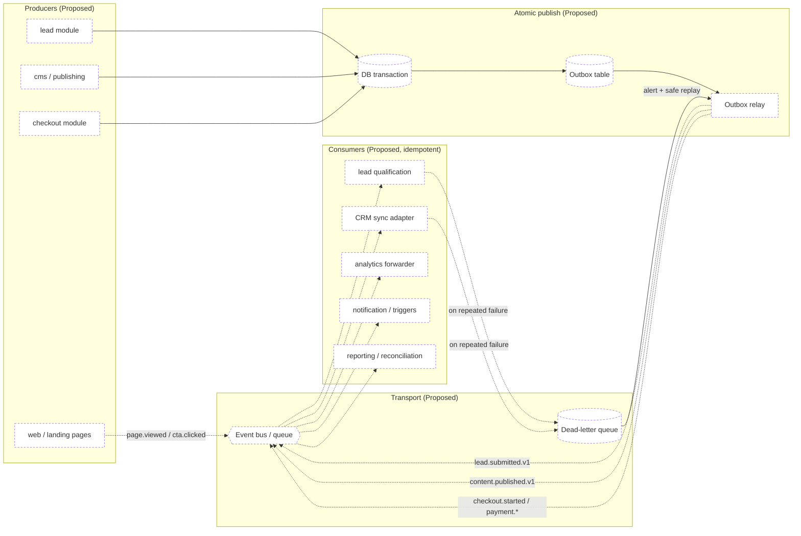

# Event flow map

Event producers, names/versions, transport, consumers, retries, dead-letter
handling and business outcomes. The authoritative schema list is
`../contracts/EVENT_CATALOG.md`.

**Legend:** dashed = async event · solid = sync. `[Proposed]` unless marked.

Last verified against commit: _pending first commit_

> Status: **Proposed** — no events are emitted yet. This is the target topology.

## Target topology (Proposed)

## Rules in force (from `.claude/rules/events.md`)

- Business-critical events published via the **outbox** (atomic with the fact).
- Consumers **idempotent** with a processed-event key.
- Retries: bounded exponential backoff + jitter; poison → **DLQ** with alert +
  safe replay.
- Event order not assumed unless transport + partition key guarantee it.
- **Analytics failure never blocks the primary learner action.**
- No secrets / unnecessary PII in the envelope.

## Producer / consumer register (Proposed)

| Event                                 | Producer                    | Consumers                                     | Transport                      | Business outcome                |
| ------------------------------------- | --------------------------- | --------------------------------------------- | ------------------------------ | ------------------------------- |
| `page.viewed`, `cta.clicked`          | web                         | analytics forwarder                           | fire-and-forget (non-blocking) | engagement / funnel metrics     |
| `lead.submitted.v1`                   | lead module (outbox)        | qualification, CRM sync, analytics, reporting | queue, at-least-once           | lead created & routed           |
| `lead.deduplicated`, `lead.qualified` | lead module / qualification | CRM sync, reporting                           | queue                          | dedupe + routing                |
| `content.published.v1`                | cms/publishing (outbox)     | cache purge, analytics, audit                 | queue                          | content live                    |
| `checkout.started`, `payment.*`       | checkout module (outbox)    | reporting, notification, reconciliation       | queue                          | conversion tracked & reconciled |
| `admin.configuration_changed`         | admin                       | audit, analytics                              | queue                          | auditable change                |
| `export.completed`                    | reporting                   | notification                                  | queue                          | export delivered                |

All rows are **Proposed**; add a `EVENT_CATALOG.md` schema row and a privacy note
when each is implemented.
