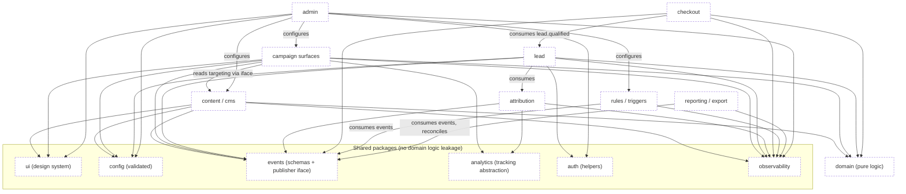

# Module dependency map

Module ownership, allowed dependencies and prohibited cross-boundary access.
Enforces `.claude/rules/product-and-modules.md` and `.claude/rules/architecture.md`.

**Legend:** solid arrow = allowed dependency (via public interface or event) ·
red/`x` = prohibited. `[Proposed]` — no modules exist yet.

Last verified against commit: _pending first commit_

> Status: **Proposed** — the repository has no feature modules. This is the
> intended boundary model; update it as the first modules land.

## Intended module boundaries (Proposed)

## Allowed

- Depend on **shared packages** (`ui`, `config`, `events`, `analytics`, `auth`,
  `observability`) and on `domain` (pure logic).
- Read another module's data **only through its published interface** or by
  **consuming its events**.
- `admin` configures other modules through their configuration interfaces.

## Prohibited

- ❌ Importing another module's database models / running queries against its
  tables.
- ❌ Mutating another module's tables directly.
- ❌ UI/`ui` package containing provider credentials or DB access.
- ❌ `domain` importing a vendor SDK (CRM, payments, email, storage, analytics).
- ❌ Circular module dependencies.
- ❌ Emitting events for UI implementation details instead of domain facts.

## Register

| Module     | Owner | Owns (tables/config) | Reads (via iface/events) | Status   |
| ---------- | ----- | -------------------- | ------------------------ | -------- |
| _none yet_ | —     | —                    | —                        | Proposed |

Add a row and a `docs/modules/<module>/CONTRACT.md` when a module is created
(`.claude/skills/module-design/SKILL.md`).
