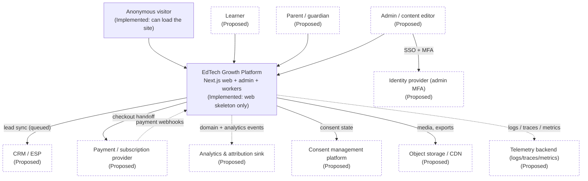

# System context

External actors and systems that interact with the platform. This is the
outermost view; internal containers are in `ARCHITECTURE_MAP.md`.

**Legend:** `[Implemented]` exists in code today · `[Proposed]` planned, not built.
Solid arrow = synchronous request · dashed arrow = asynchronous event/webhook.

Last verified against commit: _pending first commit_

> Status: mostly **Proposed** — only the Next.js web application skeleton exists
> today. Everything else below is planned.

## Actors

| Actor                  | Description                                                    | Status                   |
| ---------------------- | -------------------------------------------------------------- | ------------------------ |
| Anonymous visitor      | Unauthenticated user browsing landing/course pages.            | Implemented (site loads) |
| Learner                | Registered student using trials, courses, conversion journeys. | Proposed                 |
| Parent / guardian      | Consent giver / co-decision maker; extra privacy safeguards.   | Proposed                 |
| Admin / content editor | Configures pages, campaigns, targeting; role-gated.            | Proposed                 |

## External systems

All external systems are **Proposed**. None are configured; no credentials exist.
Each requires an ADR (and, where personal data flows, a DPA and a
`docs/privacy/DATA_INVENTORY.md` entry) before integration.
