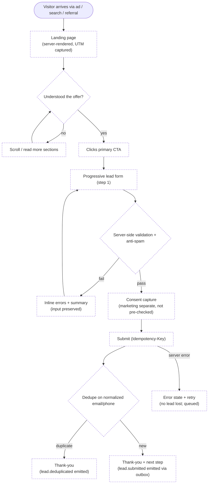
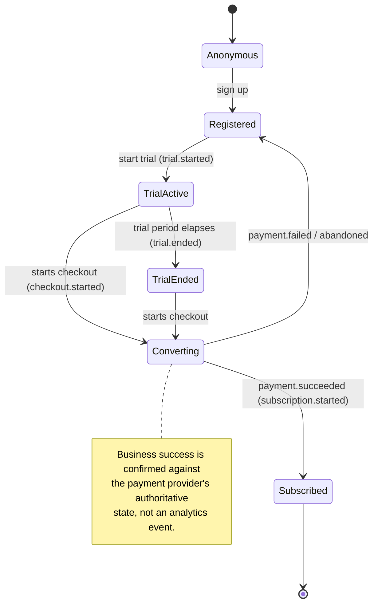
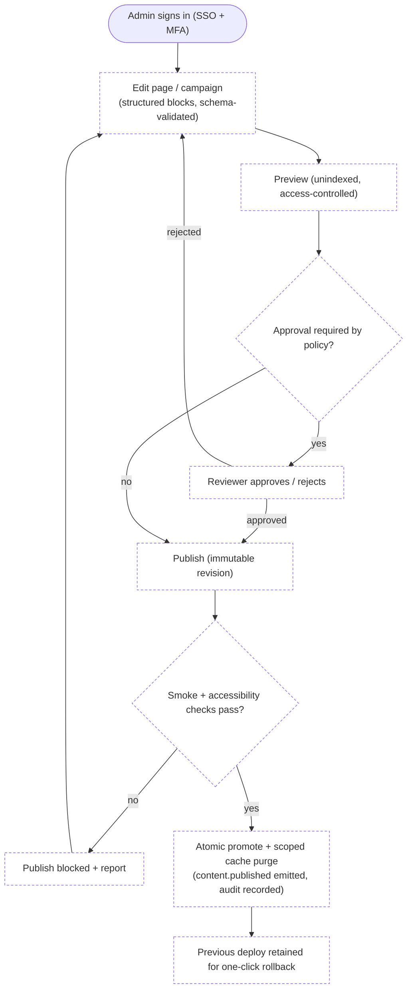

# User flow map

Learner, parent, anonymous visitor and admin journeys — success, alternate and
failure paths. Update whenever a route or journey changes
(`.claude/rules/documentation-and-maps.md`).

**Legend:** `[Implemented]` / `[Proposed]`.

Last verified against commit: _pending first commit_

> Status: **Proposed** — no product journeys are built. The only implemented flow
> is "visitor loads the home page". The flows below are planned targets.

## Anonymous visitor → lead (Proposed)

## Learner → trial → paid (Proposed)

## Admin → author → publish (Proposed)

## Parent / guardian (Proposed)

Consent-giving and oversight flows for users below the local age of consent —
parental consent capture, preference management, and data-subject requests. To be
designed with `.claude/skills/privacy-and-edtech-data-governance/SKILL.md` and
legal review before any minor data is collected.
