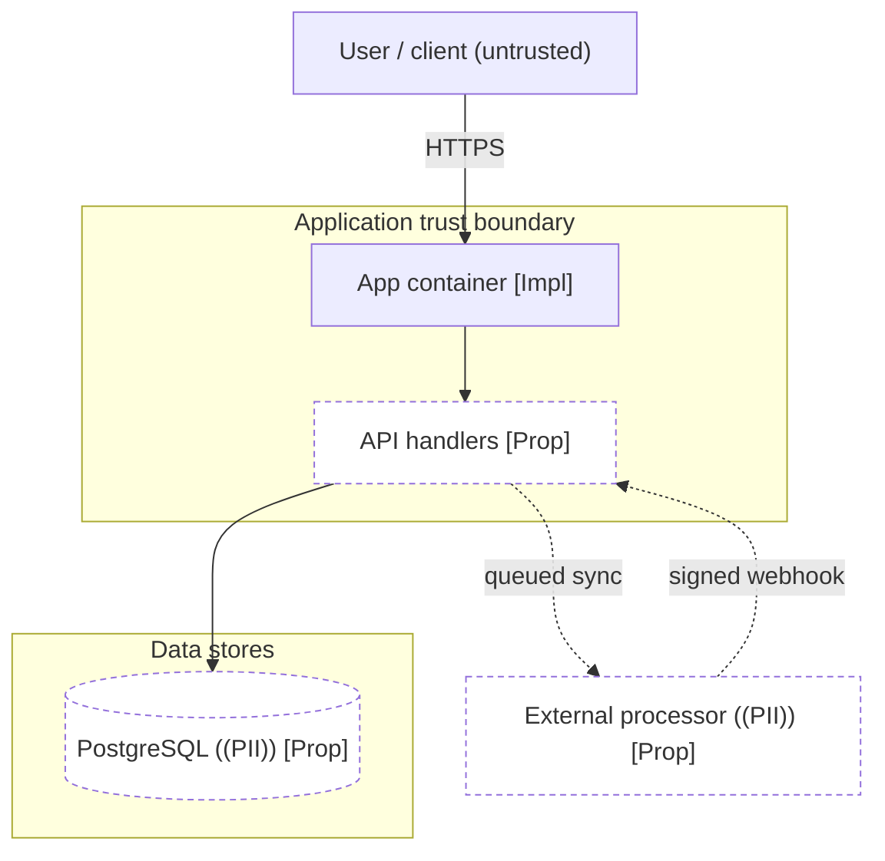
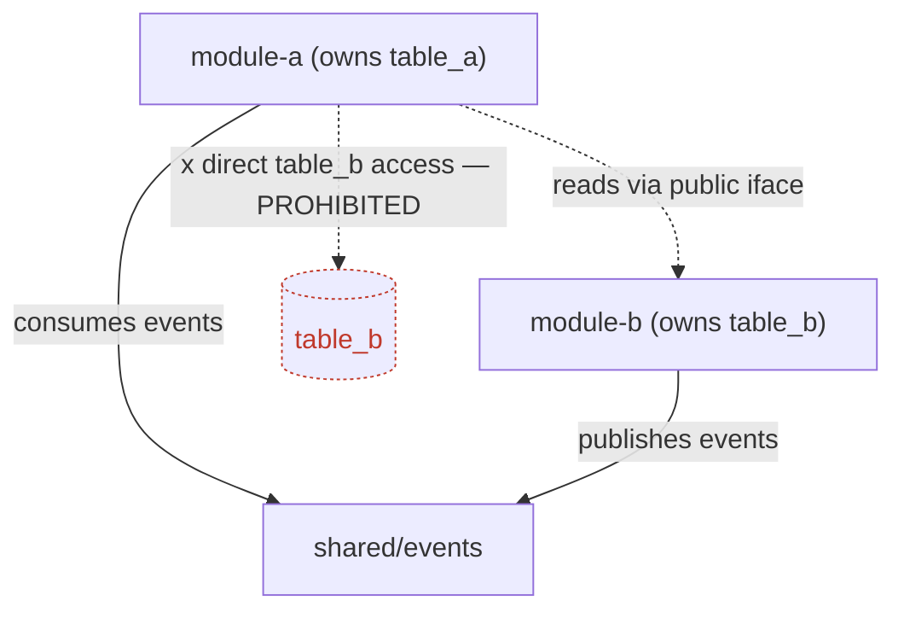
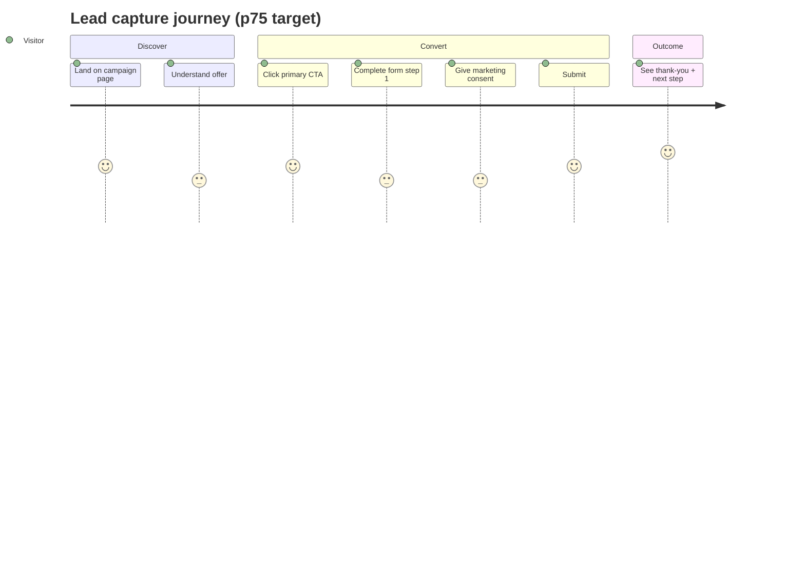
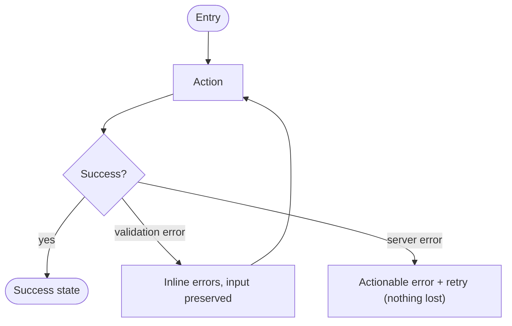
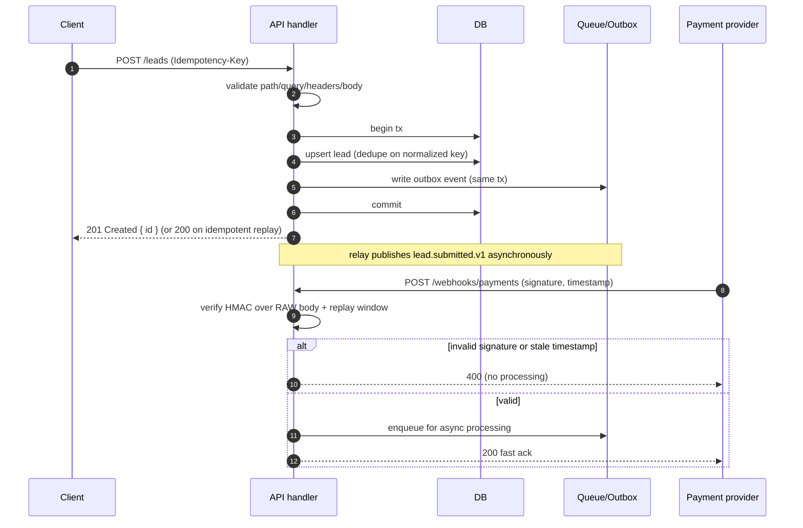
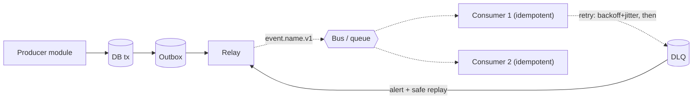
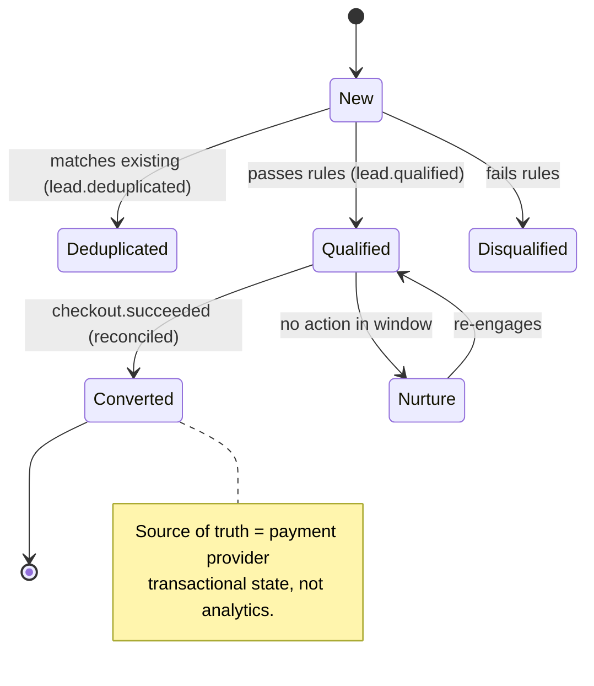
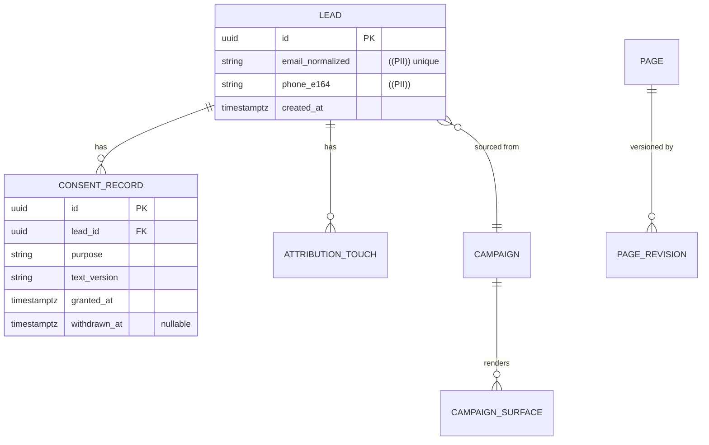
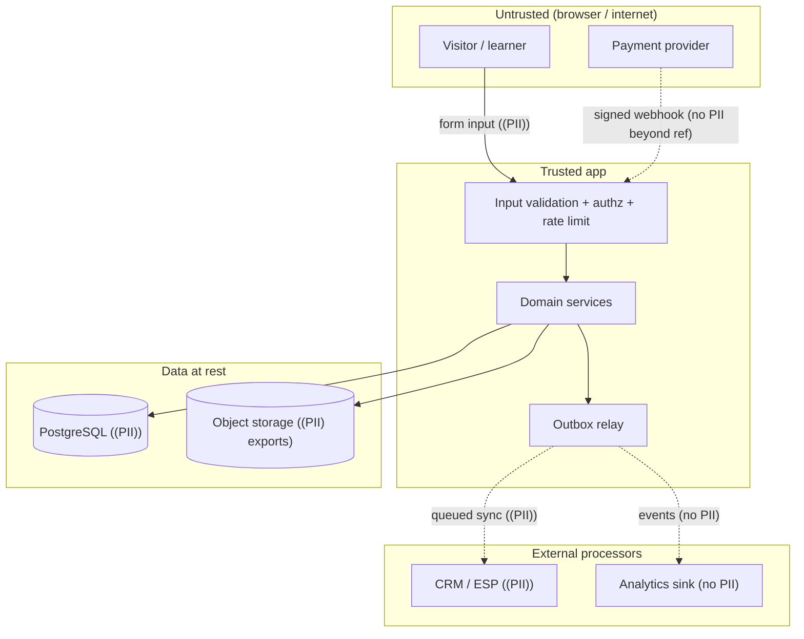

# Mermaid diagram templates

Copy a block, rename the ids, keep the legend and the
`Last verified against commit:` line. Rules: stable node ids, mark `Proposed` vs
implemented, show trust boundaries + PII movement, distinguish sync (solid) from
async (dashed), name the source of truth. See
`.claude/rules/documentation-and-maps.md` and
`.claude/skills/documentation-maps-and-diagrams/SKILL.md`.

Validate a changed diagram by extracting **this one block** to a temp `.mmd` file
and running `npx --yes @mermaid-js/mermaid-cli` on it — do not add that CLI as a
project dependency, and never feed a whole Markdown file to it as Mermaid.

---

## 1. System architecture (flowchart, containers + trust boundaries)

---

## 2. Module dependencies (flowchart, allowed vs prohibited)

---

## 3. User journey (journey + flowchart with success / alternate / failure)

---

## 4. API & webhook sequence (signature verification + bounded retries)

---

## 5. Event flow (producer → outbox → transport → consumer → DLQ)

---

## 6. State transitions (stateDiagram-v2: lead / campaign / page / trial / subscription)

---

## 7. Data relationships (erDiagram)

---

## 8. Security trust boundaries & PII movement (subgraph boundaries, PII-tagged edges)

